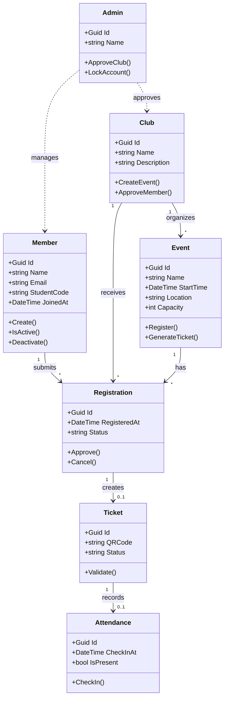

# EduHub - Class Diagram

```mermaid
classDiagram
    class Member {
        +Guid Id
        +string Name
        +string Email
        +string StudentCode
        +DateTime JoinedAt
        +Create()
        +IsActive()
        +Deactivate()
    }

    class Club {
        +Guid Id
        +string Name
        +string Description
        +CreateEvent()
        +ApproveMember()
    }

    class Event {
        +Guid Id
        +string Name
        +DateTime StartTime
        +string Location
        +int Capacity
        +Register()
        +GenerateTicket()
    }

    class Registration {
        +Guid Id
        +DateTime RegisteredAt
        +string Status
        +Approve()
        +Cancel()
    }

    class Ticket {
        +Guid Id
        +string QRCode
        +string Status
        +Validate()
    }

    class Attendance {
        +Guid Id
        +DateTime CheckInAt
        +bool IsPresent
        +CheckIn()
    }

    class Admin {
        +Guid Id
        +string Name
        +ApproveClub()
        +LockAccount()
    }

    Member "1" --> "*" Registration : submits
    Club "1" --> "*" Registration : receives
    Club "1" --> "*" Event : organizes
    Event "1" --> "*" Registration : has
    Registration "1" --> "0..1" Ticket : creates
    Ticket "1" --> "0..1" Attendance : records
    Admin ..> Club : approves
    Admin ..> Member : manages
```
